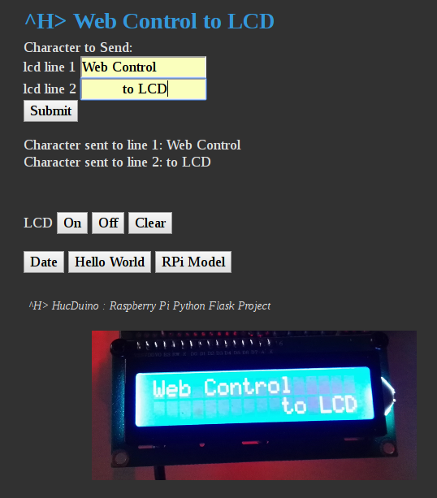

# web_lcd
Raspberry Pi Web Control to LCD in Python Flask.

* I2C PCF8574 16x2 LCD
* Written in Python Flask
* Tested on Raspberry Pi Model B, Zero W, 3 Model A Plus and 3 Model B Plus. 

## Getting started: ##
* Requirements : 

* `sudo pip install Flask`
* `sudo pip install RPLCD`

## Starting : ##
* change to the **web_lcd** directory
* chmod lcd.py to 777
* start script on the command line:

  `sudo python lcd.py`

## Accessing the Dashboard: ##
* Since the servlet is running locally, you can access the dashboard by navigating to **http://[you ip]:5000** through your web browser,

## useful links: ##
*  http://flask.pocoo.org/
*  https://github.com/dbrgn/RPLCD
